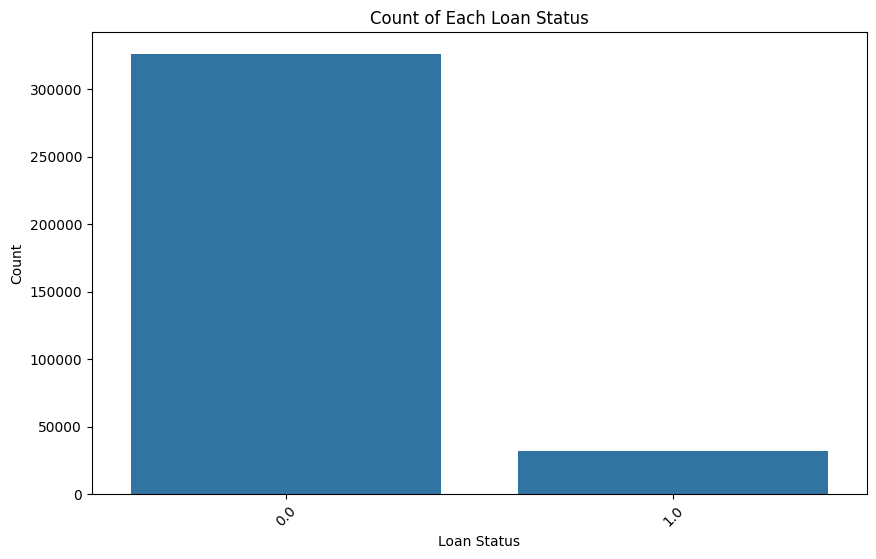

<h1 align="center">End to End Data Pipeline for Modern Data Analytics Platform in Retail Banking</h1>

<p align="center"><small>Faculty of Information Science and Engineering, University of Information Technology, Ho Chi Minh City, Viet Nam <br>
Vietnam National University, Ho Chi Minh City, Viet Nam <br> <strong>Instructor: PhD. Trong-Hop Do</strong> 
</small></p>


Contributors
--------------------- 

<div align="center">
  <table>
    <tr>
      <th>Student's ID</th>
      <th>Fullname</th>
      <th>Contact</th>
      <th>Task Assignment</th>
    </tr>
    <tr>
      <td>21522721</td>
      <td>Truc Mai-Thanh Nguyen</td>
      <td>21522721@gm.uit.edu.vn</td>
      <td>Pipeline, CDC, Data Warehouse</td>
    </tr>
    <tr>
      <td>21521937</td>
      <td>Dat Minh Nguyen</td>
      <td>21521937@gm.uit.edu.vn</td>
      <td>Analysis, Model Training</td>
    </tr>
  </table>
</div>


----------------
Description
----------------
The banking industry is a field that uses big data and is constantly growing under the push of the big data era. Exploring advanced big data analytics tools such as data mining (DM) techniques is key for the banking industry, which aims to reveal valuable information from huge volumes of data and achieve data management. In this project, we will build a Big Data Analytics System in the Retail Banking Industry.

-----------------
### Problem Statement
In the context of retail banking, it is crucial to automate the loan approval process to ensure efficient, accurate, and fair decision-making. This involves assessing various attributes of a customer's loan application and determining whether the loan should be approved or rejected.
* **Input**: Customer loan approval profile
* **Output**: Approved/Rejected

-----------------
Main task in our project
-----------------
1. Change Data Capture (CDC)
2. Data Warehousing
3. Analysis and Model Training

Technologies Used
----------------
1. Apache Kafka
2. Apache ZooKeeper
3. Apache Avro
4. Debezium Connector
5. Snowflake - Cloud Data Warehouse
6. Snowpark
7. PostgreSQL
8. Docker
9. Python
--------------
Data Pipeline
-------------


---------------
Entity Relationship Diagram 
---------------


---------------


Change Data Capture
----------------


* **Data Source**: Postgres
* **CDC Connector**: Debezium
* **Data Ingestion**: Kafka
* **Data Storage (Target)**: Snowflake Data Warehouse

#### Comparison of Change Data Capture (CDC), Batch Processing, and Real-Time Processing

| Feature          | Change Data Capture (CDC)       | Batch Processing                      | Real-Time Processing                  |
|------------------|---------------------------------|---------------------------------------|---------------------------------------|
| **Latency**      | Near real-time                  | High (scheduled intervals)            | Very low (milliseconds)               |
| **Granularity**  | Row-level changes               | Large batches                         | Individual events or small batches    |
| **Complexity**   | Moderate to high                | Low to moderate                       | High                                  |
| **Resource Usage** | Moderate                      | High during batch windows             | High                                  |
| **Use Cases**    | Data sync, real-time analytics  | Reporting, data warehousing           | Fraud detection, live dashboards      |
| **Advantages**   | Efficient data transfer         | Simple and efficient for large data   | Immediate insights and actions        |
| **Disadvantages**| Complexity, potential latency   | High latency, peak resource needs     | Complexity, cost                      |


Data Warehouse Architecture
----------------


#### Snowflake Data Warehouse Setup Detail

| Component   | Quantity | Detail                                                                                                                                     |
|-------------|----------|--------------------------------------------------------------------------------------------------------------------------------------------|
| Databases   | 2        | STAGING, PROD                                                                                                                              |
| Schemas     | 3        | STAGING.RAW: Keep original raw data as it is ingested. <br> STAGING.CLEAN: Keep cleaned data for ETL & modeling. <br> PROD.REPORTING: Used by BI User & Data Analyst |
| Warehouses  | 3        | Import Warehouse <br> Transform Warehouse <br> Reporting Warehouse                                                                         |
| Roles       | 3        | Import Role: Can read from file stage & write to both schemas in StagingDB. No Access to Prod <br> Transform Role: Can read & write to STAGING DB.CLEAN + PROD.REPORTING, No Access to STAGING DB.RAW <br> Reporting Role: Read-only access to PROD.REPORTING schema & tables |
| Users       | 3        | UserReporting (belongs to REPORTING ROLE) <br> UserTransform (belongs to TRANSFORM ROLE) <br> UserImport (belongs to IMPORT ROLE)          |


Analysis and Model Training with Snowpark
-----------------
In this project, we have opted to use `Snowpark` over `PySpark` for our data processing needs. `Snowpark`, integrated within the `Snowflake Data Cloud ecosystem`, offers robust capabilities for procedural data processing directly within Snowflake. This choice was driven by our focus on leveraging Snowflake's cloud-native architecture and seamless integration with SQL for real-time analytics, data integration, and ETL tasks.

#### Snowpark vs PySpark: Feature Comparison

| Feature               | Snowpark                                          | PySpark                                      |
|-----------------------|---------------------------------------------------|----------------------------------------------|
| **Primary Use Case**  | Data processing within Snowflake                   | General-purpose big data processing          |
| **Ecosystem**         | Snowflake Data Cloud                               | Apache Spark                                 |
| **Primary Language**  | Scala, Java (supports Python through Java)         | Python                                       |
| **Integration**       | Tight integration with Snowflake                   | Standalone or integrates with various data sources |
| **SQL Support**       | Yes, integrates procedural logic with SQL          | Yes, through Spark SQL                       |
| **Programming Models**| Procedural (Scala/Java), SQL                       | Functional (Python)                          |
| **Scalability**       | Leveraging Snowflake's scalability and performance| Distributed computing model                  |
| **ML and Analytics**  | Limited ML capabilities (growing ecosystem)       | Extensive MLlib library                      |
| **Streaming**         | Developing capabilities                           | Strong support through Spark Streaming       |
| **Graph Processing**  | Not directly supported                            | GraphX (within Apache Spark)                 |
| **Cloud-Native**      | Built for cloud data warehousing                  | Can operate in both cloud and on-premises    |
| **Community Support** | Growing community within Snowflake ecosystem      | Large and established Apache Spark community|
| **Use Cases**         | Real-time analytics, data integration, ETL        | Data processing, machine learning, analytics |

1. Data Pre-processing
* Handling Missing Data:
  + Remove columns with more than 80% missing values.
  + Replace missing values with appropriate alternatives.
* Normalization:
  + Standardize data to the correct data format.
* Creating New Features:
  + According to different levels.
  + Calculate based on different units, e.g., 2:30-4:10 -> 100m = 6000s.
  + Drop Duplicates.
* Dimensionality Reduction:
  + Remove unnecessary columns.
* Loan Status Label Statistic

2. Modeling

| Model                      | F1-macro | Accuracy | Precision | Recall |
|----------------------------|----------|----------|-----------|--------|
| KNeighborsClassifier       | **0.9881**   | **0.9881**   | **0.9884**    | **0.9882** |
| DecisionTreeClassifier     | 0.9542   | 0.9543   | 0.9565    | 0.9543 |
| GradientBoostingClassifier | 0.9483   | 0.9484   | 0.9488    | 0.9484 |
| RandomForestClassifier     | 0.9924   | 0.9924   | 0.9924    | 0.9924 |
| RidgeClassifier            | 0.7113   | 0.7114   | 0.7116    | 0.7114 |
| LogisticRegression         | 0.6726   | 0.6730   | 0.6736    | 0.6730 |

Project Organization
------------

```
└── 📁E2ERetailBanking
    └── 📁Architecture
    └── 📁Avro Schema
        └── account.avsc
        └── call_center_logs.avsc
        └── card.avsc
        └── client.avsc
        └── crm_events.avsc
        └── crm_reviews.avsc
        └── disposition.avsc
        └── district.avsc
        └── loan.avsc
        └── order.avsc
        └── transaction.avsc
    └── 📁Dataset
        └── 📁Retail-Banking-Demo-Data
        └── Retail-Banking-Demo-Data.zip
    └── debezium.json
    └── docker_compose.yml
    └── 📁ER Diagram
    └── LICENSE
    └── Makefile
    └── 📁Postgres
        └── account.sql
        └── card.sql
        └── client.sql
        └── CRMCallCenterLogs.sql
        └── CRMEvents.sql
        └── CRMReviews.sql
        └── disposition.sql
        └── district.sql
        └── full_table_created.sql
        └── insert_sample.sql
        └── loan.sql
        └── order.sql
        └── transaction.sql
    └── README.md
    └── requirements.txt
    └── 📁Snowflake Data Warehouse
        └── 0 - Postgres - Script.sql
        └── 1 - MODIFY.sql
        └── 2 - IMPORT RESOURCE.sql
        └── 3 - TRANSFORM RESOURCE.sql
        └── 4 - REPORTING RESOURCE.sql
        └── 5 - RESOURCE MONITORS.sql
        └── 6 - ETL.sql
        └── README.md
        └── 📁Warehouse
    └── 📁src
        └── 📁cdc
            └── cdc.py
            └── cdc_extractor.py
            └── cdc_handler.py
            └── cdc_kafka_list_topic.py
            └── cdc_loader.py
            └── cdc_transformer.py
            └── __init__.py
        └── 📁config
            └── config_cdc.json
        └── 📁data_warehouse
            └── .gitignore
            └── dw_etl.py
            └── dw_snowflake_connection.py
            └── __init__.py
        └── 📁modeling
            └── Snowpark_Model_Training.ipynb
        └── 📁pipeline
            └── run_cdc_pipeline.py
            └── run_dw_pipeline.py
            └── __init__.py
        └── __init__.py
```
--------
License
--------
This project is licensed under the MIT License - see the [LICENSE](LICENSE) file for details.
```
The MIT License (MIT)
Copyright (c) 2024, Truc Mai-Thanh Nguyen and Dat Minh Nguyen

Permission is hereby granted, free of charge, to any person obtaining a copy of this software and associated documentation files (the "Software"), to deal in the Software without restriction, including without limitation the rights to use, copy, modify, merge, publish, distribute, sublicense, and/or sell copies of the Software, and to permit persons to whom the Software is furnished to do so, subject to the following conditions:

1. The above copyright notice and this permission notice shall be included in all copies or substantial portions of the Software.
2. If the Software or its derivative works are used in academic, research, or scholarly publications, proper citation must be provided to the authors as specified.

THE SOFTWARE IS PROVIDED "AS IS", WITHOUT WARRANTY OF ANY KIND, EXPRESS OR IMPLIED, INCLUDING BUT NOT LIMITED TO THE WARRANTIES OF MERCHANTABILITY, FITNESS FOR A PARTICULAR PURPOSE AND NONINFRINGEMENT. IN NO EVENT SHALL THE AUTHORS OR COPYRIGHT HOLDERS BE LIABLE FOR ANY CLAIM, DAMAGES OR OTHER LIABILITY, WHETHER IN AN ACTION OF CONTRACT, TORT OR OTHERWISE, ARISING FROM, OUT OF OR IN CONNECTION WITH THE SOFTWARE OR THE USE OR OTHER DEALINGS IN THE SOFTWARE.

```
----------------
Citation
----------------
If you use this project in your research, please cite it as follows:

```
@online{retailbankingtrucdat,
  author       = {Truc Mai-Thanh Nguyen and Dat Minh Nguyen},
  title        = {End to End Data Pipeline for Modern Data Analytics Platform in Retail Banking},
  year         = {2024},
  howpublished = {\url{https://github.com/trucnmt/E2ERetailBanking}}
}
```

---------------
<p><small>DS200.O21 - Big Data Analytic Final Project - Truc Mai-Thanh Nguyen and Dat Minh Nguyen</small></p>
